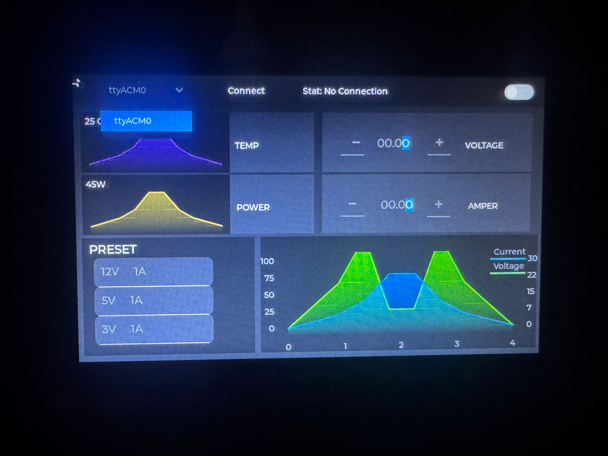
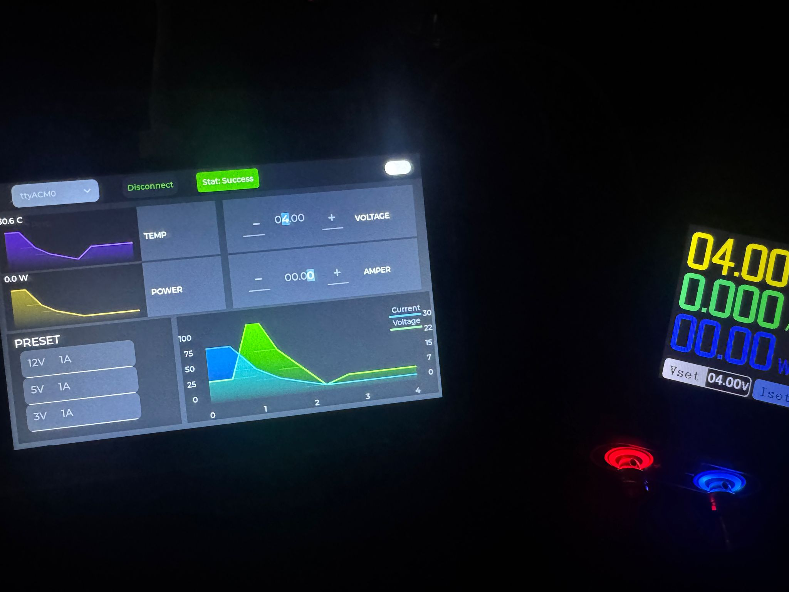

# DPS150 LVGL Interface



## Overview

This project provides a modern graphical user interface for the DPS150 power supply unit using the Light and Versatile Graphics Library (LVGL). The interface is designed to run on embedded Linux systems like Raspberry Pi, offering an intuitive and responsive control panel for monitoring and adjusting power supply parameters.

## Features

- **Real-time Monitoring**: Display voltage, current, power, and other key metrics
- **Touch-enabled Controls**: Adjust parameters using an intuitive touch interface
- **Multi-platform Support**: Runs on various Linux-based systems
- **Customizable UI**: Easily modify the interface to suit your specific needs
- **Low Resource Usage**: Optimized for embedded systems with limited resources

## Screenshots




## Requirements

- Raspberry Pi or compatible Linux system
- DPS150 Power Supply Unit
- Display with touch capability (recommended)
- Linux with development tools installed

### Dependencies

- LVGL (8.3.0 or newer)
- CMake (3.10 or newer)
- GCC/G++ with C99/C++17 support
- Required development packages:
  - For SDL2 backend: `libsdl2-dev`, `libsdl2-image-dev`
  - For DRM backend: `libdrm-dev`
  - For input handling: `libevdev-dev`
  - For Wayland: `libwayland-dev`, `libxkbcommon-dev`
  - For X11: `libx11-dev`

## Installation

### 1. Clone the repository

```bash
git clone https://github.com/ozknyusuf/dps150-lvgl-interface.git
cd dps150-lvgl-interface
```

### 2. Configure the build

```bash
mkdir build
cd build
cmake ..
```

### 3. Build the project

```bash
make -j$(nproc)
```

### 4. Run the interface

```bash
./bin/lvglsim
```

## Configuration

The interface behavior can be configured by modifying the `lv_conf.h` file in the project root directory. This file controls LVGL features, including:

- Display resolution and color depth
- Input device settings
- Memory usage
- Enabled widgets and features

## Usage

1. Connect your DPS150 Power Supply Unit to your Linux system
2. Launch the application
3. The main screen displays current power supply metrics
4. Use the touch interface to adjust settings and control the power supply

## Development

### Project Structure

```
.
├── CMakeLists.txt              # Main build configuration
├── lv_conf.h                   # LVGL configuration
├── scripts/                    # Build and utility scripts
├── src/
│   ├── lib/                    # Platform-specific code
│   │   ├── display_backends/   # Display drivers
│   │   ├── indev_backends/     # Input device drivers
│   │   └── *.c                 # Common platform code
│   ├── main.c                  # Application entry point
│   ├── ui.c                    # UI initialization
│   ├── screens/                # UI screens
│   ├── components/             # UI components
│   └── fonts/                  # Custom fonts
└── lv_port_linux/              # LVGL port for Linux
    └── lvgl/                   # LVGL library
```

### Adding New Screens

1. Create a new file in the `src/screens/` directory
2. Implement your screen using LVGL widgets
3. Register your screen in `src/ui.c`

### Customizing the Interface

The UI can be customized by modifying the files in `src/screens/` and `src/components/`. The LVGL library provides a wide range of widgets and styling options to create your desired interface.

## Troubleshooting

### Common Issues

- **"No SOURCES given to target"**: Ensure all required source files are properly included in CMakeLists.txt
- **"Possible failure to include lv_conf.h"**: Check that your lv_conf.h is properly configured and located in the project root
- **"Undefined reference to backend functions"**: Make sure the required backends are enabled in lv_conf.h and their source files are included in the build

### Debug Mode

To enable debug mode, uncomment the following line in CMakeLists.txt:

```cmake
#set(CMAKE_C_FLAGS "${CMAKE_C_FLAGS} -O0 -ggdb")
```

## Contributing

Contributions are welcome! Please feel free to submit a Pull Request.

1. Fork the repository
2. Create your feature branch (`git checkout -b feature/amazing-feature`)
3. Commit your changes (`git commit -m 'Add some amazing feature'`)
4. Push to the branch (`git push origin feature/amazing-feature`)
5. Open a Pull Request

## Current Development Status

This project is currently in active development and has several areas that need improvement:

- Add proper error handling for device connections
- Improve UI responsiveness on various display sizes
- Implement additional features for the DPS150 power supply
- Add support for more input methods
- Optimize performance on lower-powered devices

I welcome contributions from the community to help enhance this project!

## AI Assistance

In developing this project, I have utilized AI tools to assist with:
- Resolving build and configuration issues
- Creating this documentation
- Optimizing some parts of the code structure
- Troubleshooting implementation challenges

AI assistance has been valuable in overcoming technical obstacles, but the core implementation and design decisions remain my original work.

## License

This project is licensed under the MIT License - see the [LICENSE](LICENSE) file for details.

## Acknowledgments

- [LVGL](https://lvgl.io/) for providing the excellent graphics library
- [DPS150](https://link-to-dps150-docs) for the power supply hardware
- All contributors who have helped with this project

## Contact

Yusuf Özkan - [@ozknyusuf](https://github.com/ozknyusuf)

Project Link: [https://github.com/ozknyusuf/dps150-lvgl-interface](https://github.com/ozknyusuf/dps150-lvgl-interface)
